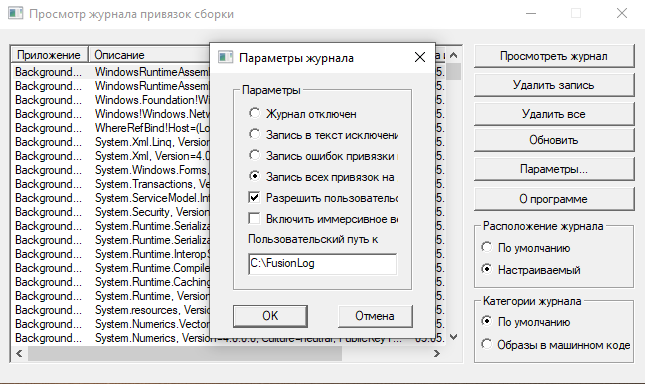
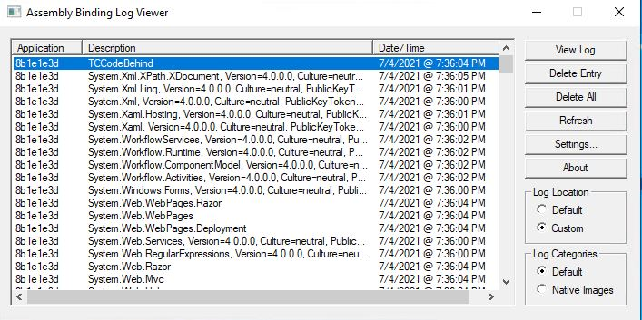
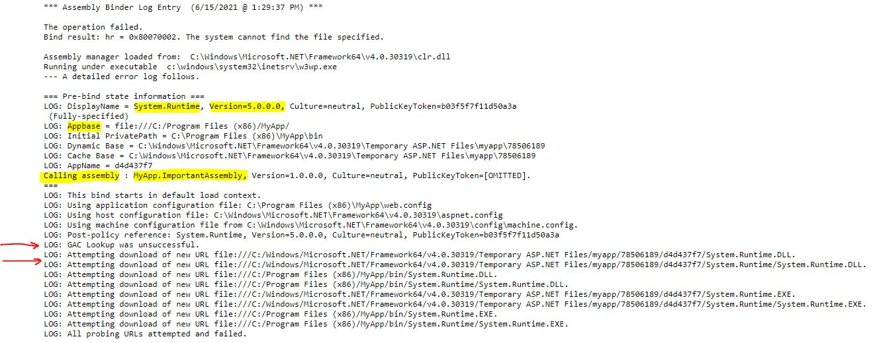

## **Fusion Log**

Assembly Binding Log Viewer, он же Fuslogvw.exe — чрезвычайно полезный инструмент, который во много раз облегчил мне жизнь как разработчику. Он регистрирует сведения обо всех привязках сборок, создаваемых приложением. С помощью Fusion Log вы можете изучить все привязки сборок, которые успешно или неудачно загружались приложением.

**Fusion Log** автоматически устанавливается вместе с Visual Studio, но если вы столкнулись с ошибками загрузки сборок в рабочей среде и не хотите устанавливать Visual Studio на рабочие серверы, вы можете запустить этот инструмент, скопировав **`FUSLOGVW.exe`** и **`flogvwrc.dll`** из одной из папок Microsoft SDK (например, `C:\Program Files (x86)\Microsoft SDKs\Windows\v10.0A\bin\NETFX 4.8 Tools`).

Подробнее о **Fusion Log**, о том, где его скачать и как настроить, можно прочитать в документации Microsoft: [Fuslogvw.exe (средство просмотра журнала привязки сборок)](https://docs.microsoft.com/en-us/dotnet/framework/tools/fuslogvw-exe-assembly-binding-log-viewer).

Так же есть более улучшенная версия программы [Fusion++](https://github.com/awaescher/Fusion/tree/feature/Add-LogInfo-To-App-Title).

Давайте теперь посмотрим, как работает **Fusion Log**. У меня есть приложение, которое работает как на .NET Framework 4.8, так и на .NET 5\. На данный момент .NET Framework 4.8 развёрнута в рабочей среде, так как миграция на .NET 5 ещё не завершена. В одном из проектов что-то пошло не так, и цель для .NET Framework 4.8 была удалена. Из-за этого была скомпилирована только версия сборки .NET 5, которая затем была включена в установочный пакет приложения для .NET Framework 4.8. Это, конечно, приведёт к ошибке во время выполнения, поскольку приложение пока не ожидает использования сборок .NET 5\. Теперь давайте воспользуемся нейрализатором из «Людей в чёрном» и посмотрим, как мы можем определить первопричину, если не знаем, что на самом деле стало причиной ошибки.

Изначально в журналах отображается следующее сообщение об ошибке, указывающее на сбой при запуске приложения: `error : System.IO.FileNotFoundException: Could not load file or assembly 'System.Runtime, Version=5.0.0.0, Culture=neutral, PublicKeyToken=b03f5f7f11d50a3a' or one of its dependencies. The system cannot find the file specified.`

Давайте запустим Fusion Log и подготовим его к регистрации привязки сборок. Я настроил пользовательский путь к журналу и регистрацию всех привязок, как успешных, так и неудачных. По умолчанию регистрируются обычные запросы привязки сборок (помечены как «По умолчанию» в категориях журнала), но также можно регистрировать привязки сборок для собственных образов, созданных с помощью Ngen.exe (генератора собственных образов) — для этого нужно изменить категорию журнала на «Собственные образы». Подробнее о Native Image Generator можно прочитать здесь: [Ngen.exe](https://learn.microsoft.com/en-us/dotnet/framework/tools/ngen-exe-native-image-generator).

Вкратце, для работы программы нужны такие настройки

и нужно самому создать папку, так как программа этого не умеет. Рекомендую настроить свою папку, а не использовать по умолчанию. Или можно напрямую настроить в редакторе реестра, о том как это сделать можно почитать [здесь](https://stackoverflow.com/questions/255669/how-to-enable-assembly-bind-failure-logging-fusion-in-net)

Хорошо, мы готовы снова попытаться запустить наше приложение, чтобы получить журнал привязки сборки. После запуска приложения мы видим, что в журнал записывается много привязок:

Может быть сложно и трудоёмко просматривать все привязки непосредственно в пользовательском интерфейсе Fusion Log, особенно если приложение довольно большое, поэтому я обычно перехожу к настроенному мной пути к пользовательскому журналу и ищу имя файла, которое совпадает с именем сборки, вызывающей ошибку. В нашем случае я буду искать «System.Runtime, версия \= 5.0.0.0». Как только файл HTML будет найден, мы сможем открыть его и получить дополнительную информацию о:

* приложение, инициировавшее привязку,  
* подробные сведения о самой привязке, например, о том, какая сборка вызвала эту конкретную привязку,  
* причина сбоя или информация о том, что привязка прошла успешно,  
* была ли найдена сборка в GAC,  
* если сборка не была найдена в GAC, список других URL-адресов, по которым может находиться текущая сборка.

Как вы можете видеть на скриншоте выше, сначала был выполнен поиск в GAC, а после того, как он не увенчался успехом, были проверены базовые местоположения приложений. Когда соответствующая сборка не была найдена, привязка была зарегистрирована как неудачная. Кроме того, из журнала мы видим, что вызывающая сборка, то есть та, которая запускает загрузку System.Runtime версии 5.0.0.0, — это MyApp.ImportantAssembly. Вероятно, именно эта сборка вызывает ошибку\!

Благодаря Fusion Log мы смогли сузить круг поиска до потенциального злоумышленника. Теперь давайте воспользуемся ILSpy, чтобы проверить MyApp.ImportantAssembly на наличие несоответствий.

## **ILSpy**

Ещё один отличный инструмент с открытым исходным кодом, который позволяет просматривать и декомпилировать сборки .NET. Он может пригодиться, например, если вам нужно подтвердить теорию о том, что сборка с неправильной целевой платформой развёрнута как часть вашего приложения. Я неоднократно использовал его при переходе с .NET Framework на .NET Core, а также при переносе проектов в новый формат проектов C\# — ILSpy позволяет очень легко просматривать содержимое сборки и проверять, правильно ли сгенерирована идентификация сборки, а также подтверждать, что все необходимые коды и зависимости включены должным образом.

ILSpy можно загрузить из [Microsoft Store](https://translated.turbopages.org/proxy_u/en-ru.ru.3d3d21aa-6811d5d3-97a6140f-74722d776562/https/www.microsoft.com/nb-no/p/ilspy/9mxfbkfvsq13?rtc=1&activetab=pivot:overviewtab) или с [GitHub](https://translated.turbopages.org/proxy_u/en-ru.ru.3d3d21aa-6811d5d3-97a6140f-74722d776562/https/github.com/icsharpcode/ILSpy).

Основываясь на приведённом выше примере, мы определили, что сборка System.Runtime версии 5.0.0.0 пытается загрузиться в MyApp.ImportantAssembly.dll. Давайте воспользуемся ILSpy и проверим содержимое этой сборки:

![][image5]

О боже\! Как вы можете видеть на скриншоте выше, проект, из которого была создана сборка, действительно ориентирован на .NET 5, а не на .NET Framework 4.8, что приведёт к сбою, поскольку приложение по-прежнему развёртывается на .NET Framework 4.8 в рабочей среде. Теперь мы определили первопричину и можем обратиться к ответственной команде разработчиков, чтобы исправить это и добавить дополнительную целевую платформу в этот конкретный проект.

Отличная работа\! ;)
