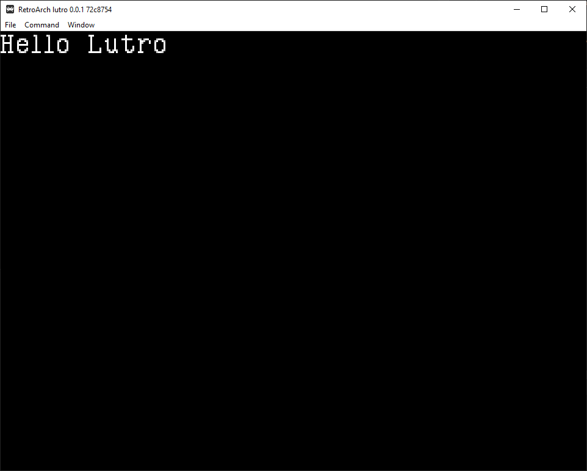

# Создание игры на Lutro

Lutro - это небольшой фреймворк для создания игр на Lua.

## Текст

для начала нужно загрузить шрифт, можно это сделать из png файла. Я взял данный файл у игры platformer.

```lua
    font = lutro.graphics.newImageFont("font.png",
    		" abcdefghijklmnopqrstuvwxyzABCDEFGHIJKLMNOPQRSTUVWXYZ0123456789.,!?-+/")
    lutro.graphics.setFont(font)
```



